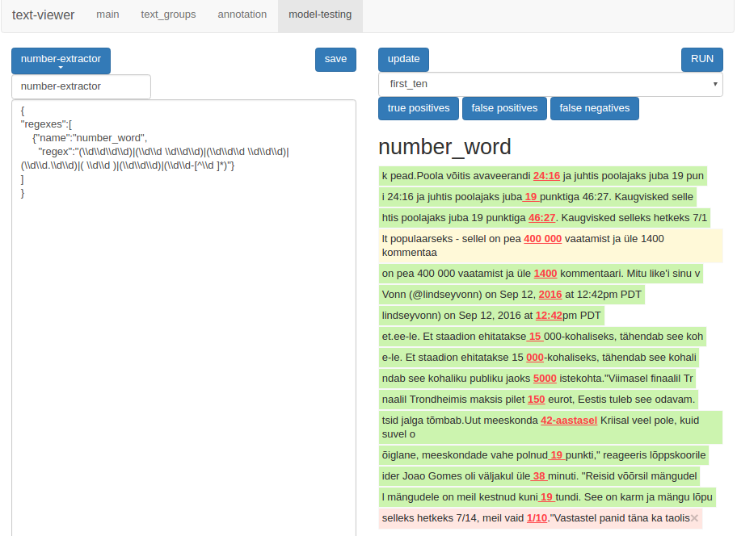
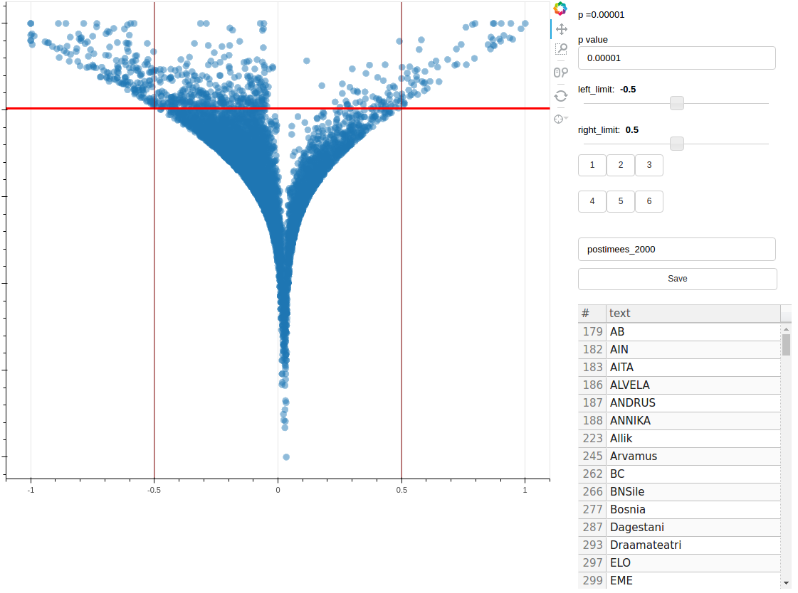
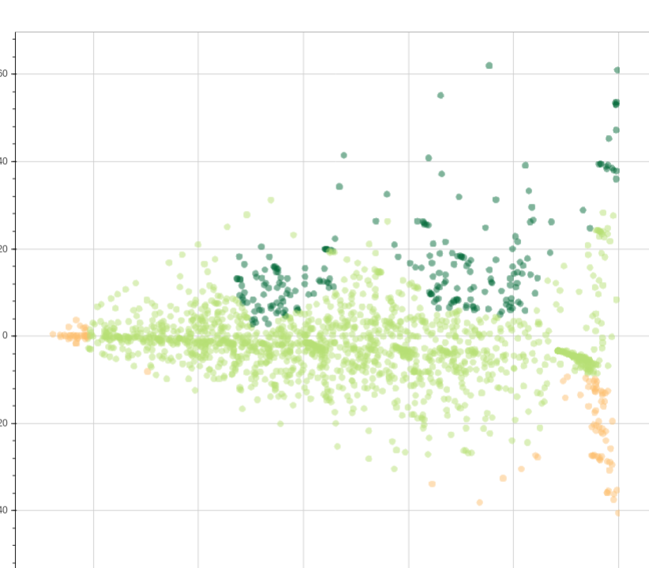
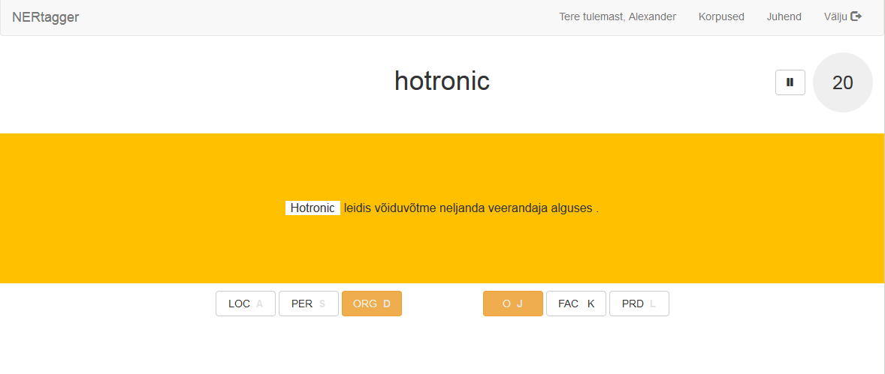
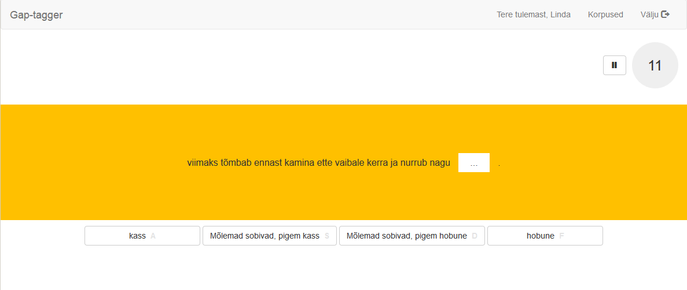

EstNLTK (NLTK ehk Natural Language ToolKit) on peamiselt Pythonis kirjutatud kogumik teeke eestikeelsete tekstide töötluseks.

EstNLTK eesmärkideks on olemasolevate keeletehnoloogia tööriistade omavaheline liidestamine ja kättesaadavaks muutmine ning uute loomine.

# Huvitavamaid tööriistu, mis projekti käigus on valminud:
 
## estnltk

* [Dokumentatsioon](http://estnltk.github.io/estnltk)
* [Kood](http://github.com/estnltk/estnltk)

EstNLTK kui projekti tuumaks on Pythoni estnltk teek, milles sisaldub:

* eesti keele sõnestamine ehk sõnapiiride tuvastamine ehk üksustamine (tokeniseerimine)
* eesti keele lausestamine ehk lausepiiride tuvastamine
* eesti keele osalausestamine ehk osalausepiiride tuvastamine
* eesti keele lemmatiseerimine ehk sõnade algvormide (lemmade) määramine ning morfoloogiline analüüs ja ühestamine (liidestudes mugavalt vabamorfiga)
* sõnaliikide määramine
* eesti keele morfoloogiline süntees (etteantud lemma ja grammatilise vormi põhjal õige sõnakuju tuletamine)
* nimeolemite e nimega üksuste tuvastamine eestikeelsest tekstist (*NER* ehk *Named-entity recognition*)
* liidestus eesti Wordnetiga
* eestikeelsete ajaväljendite tuvastamine ning nende semantika esitamine (TIMEX3 formaadis)
* pindsüntaktiline analüüs ning sõltuvussüntaktiline analüüs:
	* masinõppepõhine analüüs MaltParseri abil
	* reeglipõhine analüüs mooduli EstCG abil

## Texts-viewer

* [Dokumentatsioon](https://github.com/estnltk/texts-viewer/blob/master/README.md)
* [Kood](https://github.com/estnltk/texts-viewer)

Veebitööriist tekstide käsitsi märgendamiseks ning eraldusmustrite testimiseks. 
Võimaldab teksti kiiresti mustrite alusel märgendada ning hiljem uusi mustrieraldustööriistu olemasolevate annotatsioonide vastu testida.

## Volcanoplot

* [Dokumentatsioon](https://github.com/estnltk/volcanoplot/blob/master/README.md)
* [Kood](https://github.com/estnltk/volcanoplot)

Käsureatööriist html väljundiga, mis võimaldab visuaalselt võrrelda kahte csv-kujul sagedusloendit. [Näide kasutamisest postimehe artiklite põhjal](https://github.com/estnltk/volcanoplot/blob/master/docs/postimees_tutorial.ipynb).

## Cluster-labelling-plot

* [Dokumentatsioon](https://github.com/estnltk/cluster-labelling-plot/blob/master/README.md)
* [Kood](https://github.com/estnltk/cluster-labelling-plot)

Jupyter-põhine tööriist andmepunktiklastrite klassifitseerimiseks.

## Textclassifier

* [Kood](https://github.com/estnltk/textclassifier)

## Ner-tagger

* [Dokumentatsioon](https://github.com/estnltk/ner-tagger/blob/master/README.md)
* [Kood](https://github.com/estnltk/ner-tagger)

Ner-tagger on veebitööriist, mis aitab märgendada ja annoteerida teksti. Eelkõige mõeldud nimeolemite märgendamiseks.

## gap-tagger

* [Dokumentatsioon](https://github.com/estnltk/gap-tagger/tree/master/docs)
* [Kood](https://github.com/estnltk/gap-tagger)

Gap-tagger on veebipõhin tööriist lauselünga-eksperimentide läbiviimiseks. Eksperimendi käigus kuvatakse kasutajale lause ühe eemaldatud sõnaga. Selle lünga peab ta täitma ühega pakutud valikutest.

## episodeminer

* [Dokumentatsioon](https://estnltk.github.io/episode-miner) Olemas, tuleb veel üles panna.
* [Kood](https://github.com/estnltk/episode-miner)

Episode-miner leiab Winepi algoritmiga sündmuste jadast sagedamini esinevad episoodid. Näiteks tekstist tihti kasutatud fraasid või sõnadest sagedasemad tähekombinatsioonid. Võimaldab sündmusi rühmitada ja toob näiteid leitud episoodidest.

## pattern-examiner

* [Dokumentatsioon](https://github.com/estnltk/pattern-examiner/blob/master/README.md)
* [Kood](https://github.com/estnltk/pattern-examiner)

Pattern-examiner on tööriist suurte tekstihulkade sarnansuse hindamiseks, nende klasterdamiseks ja filtreerimiseks.

--------- 

EstNLTK on Loodud Tartu Ülikoolis, projektijuht on Sven Laur.
